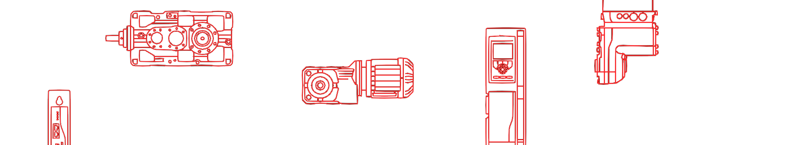
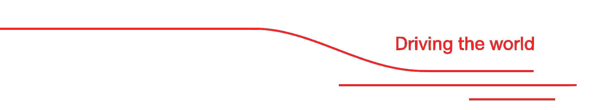

<!-- This is my README file for my profile page. Feel free to get *inspired* -->
# README.md

<!-- Header -->

<!-- Some Badges -->

  
  
  

<!-- Introduction-->
## Welcome to my profile

I am Marcel Steinle, dual student of Computer Science (B.Sc.) at SEW Eurodrive Germany. I started studying in the beginning of 2024 and finish my bachelor's degree by mid 2027.

I like to ride my bicycle, meditate, build and troubleshoot computers in my freetime.

<!-- More Badges -->
### Tech Stack

<table align="center">
  <tr>
    <td align="center">
      <em>Coding Languages</em>
    </td>
    <td align="center">
      
    </td>
    <td align="center">
      
    </td>
    <td align="center">
      
    </td>
    <td align="center">
      
    </td>
  </tr>
  <tr>
    <td align="center">
      <em>Web Languages</em>
    </td>
    <td align="center">
      
    </td>
    <td align="center">
      
    </td>
    <td align="center">
      
    </td>
    <td align="center">
      
    </td>
  </tr>
  <tr>
    <td align="center">
      <em>Web Technologies</em>
    </td>
    <td align="center">
      
    </td>
    <td align="center">
      
    </td>
    <td align="center">
      
    </td>
    <td align="center">
      
    </td>
  </tr>
  <tr>
    <td align="center">
      <em>Other Skills</em>
    </td>
    <td align="center">
      
    </td>
    <td align="center">
      
    </td>
    <td align="center">
      
    </td>
    <td align="center">
      
    </td>
  </tr>
</table>

<!-- Spacer -->

<!-- Trivia -->
### About SEW‑EURODRIVE

*SEW‑EURODRIVE is a global, family‑owned leader in drive and automation technology, headquartered in Bruchsal, Germany. Founded in 1931, the company develops and produces gearmotors, gear units, motors, industrial gear solutions, and complete automation systems used across countless industries. With more than 22,000 employees worldwide, 17 production plants, and over 90 Drive Technology Centers in 56 countries, SEW‑EURODRIVE supports customers with customized solutions, lifecycle services, and a highly modular product portfolio. ([Source](https://www.sew-eurodrive.de/))*

<!-- Footer -->

